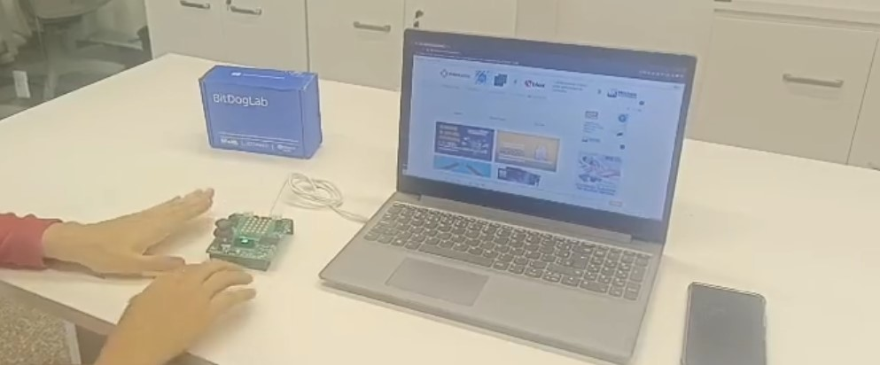

# 📚 Volume Zero

> Um sistema embarcado gamificado para controle de ruído em ambientes de estudo



---

## 🎯 Sobre o Projeto

O **Volume Zero** é um sistema embarcado desenvolvido para promover o silêncio em bibliotecas, salas de leitura e ambientes de estudo coletivo. Ele detecta automaticamente infrações por ruído e aplica uma resposta **gamificada** ao infrator: um minijogo embarcado que precisa ser completado para desbloquear o equipamento da mesa.

Este projeto foi desenvolvido durante um **hackathon** no contexto do curso EmbarcaTech, com foco em soluções criativas utilizando os recursos da placa de desenvolvimento BitDogLab.

---

## 🧠 Motivação

Mesmo em locais projetados para estudo, o silêncio muitas vezes é quebrado. O Volume Zero foi criado para:

- **Detectar infrações sonoras automaticamente**
- **Educar o usuário de forma lúdica**
- **Evitar a necessidade de fiscalização humana**
- **Criar uma cultura de colaboração e disciplina sonora**

---

## ⚙️ Funcionalidades

- 📡 **Detecção de ruído ambiente** com microfone analógico
- 📶 **Comunicação via MQTT** para monitoramento remoto das infrações
- 🎮 **Minijogo embarcado** ativado em caso de infração sonora
- 🧠 **Modo desafio**: o usuário só desbloqueia a mesa completando o jogo
- 💡 **Feedback em display OLED e matriz de LEDs**
- 🕹️ **Joystick e botão físico** para interação no minigame

---

## 🛠️ Arquitetura do Sistema

- **Microcontrolador**: Raspberry Pi Pico W
- **Sensor de som**: Microfone analógico via ADC
- **Display**: OLED via I2C
- **Interface de Jogo**: Matriz de LEDs 5x5
- **Controle do usuário**: Joystick analógico + botão
- **Comunicação**: MQTT (Wi-Fi)
- **Firmware**: C/C++ com Raspberry Pi Pico SDK

---

## 🧩 Como Funciona

1. O microfone detecta continuamente o som ambiente.
2. Se o ruído ultrapassar o limite pré-configurado, uma **infração** é registrada.
3. O sistema envia essa informação para o servidor MQTT.
4. A mesa entra em **modo desafio** e bloqueia o uso do sistema.
5. O usuário precisa completar o **minijogo embarcado**.
6. Após vencer o jogo, o sistema é desbloqueado automaticamente.

---

## 🚀 Como Rodar o Projeto

> ⚠️ **Pré-requisitos**:
> - Raspberry Pi Pico W
> - SDK `pico-sdk`
> - Ambiente de desenvolvimento C/C++

### 1. Clone o repositório

```bash
git clone https://github.com/seu-usuario/volume-zero.git
cd volume-zero
```

### 2. Configure o SDK

Siga as instruções oficiais do [Raspberry Pi Pico SDK](https://github.com/raspberrypi/pico-sdk) para configurar seu ambiente de build.

### 3. Compile o Firmware

```bash
mkdir build
cd build
cmake ..
make
```

### 4. Flash no Pico W

Conecte seu Raspberry Pi Pico W no modo USB e arraste o `.uf2` gerado ou use ferramentas como `picotool`.

---

## 🤖 Uso de Inteligência Artificial no Projeto

- Assistência na programação com **ChatGPT (GPT-4o)**
- Correções de código com **DeepSeek (DPSeek)**
- Apoio na redação técnica deste repositório e do relatório

---

## 📋 Relatório Técnico

O relatório completo do projeto pode ser acessado em [`/public/docs/Volume-Zero-Relatorio.pdf`](public/docs/Volume-Zero-Relatorio.pdf).
